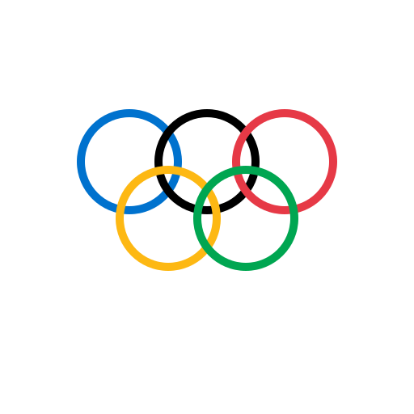

## 1. 
- Měl bych mu dodat SVG -> logo, ikonu, plakát zůstane ostrý a přesný při jakékoli velikosti. Následně PDF -> pro tisk. A PNG -> web, prezentace. 

## 2.
- Rastrová grafika -> pixely, -> ztrátová komprese.
- Vektorová grafika -> grafy, křivky -> můžeme zvětšovat a zmenšovat donekonečna.

## 3. 
1. 
2. 
3. [pdf](logo.pdf)